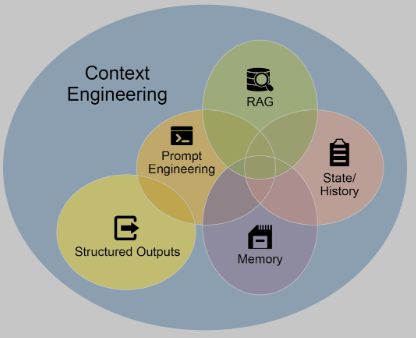

# Chapter 1: Prompt Chaining

## Prompt Chaining Pattern Overview

Prompt chaining, sometimes referred to as Pipeline pattern, represents a powerful paradigm for handling intricate tasks when leveraging large language models (LLMs). Rather than expecting an LLM to solve a complex problem in a single, monolithic step, prompt chaining advocates for a divide-and-conquer strategy. The core idea is to break down the original, daunting problem into a sequence of smaller, more manageable sub-problems. Each sub-problem is addressed individually through a specifically designed prompt, and the output generated from one prompt is strategically fed as input into the subsequent prompt in the chain.

This sequential processing technique inherently introduces modularity and clarity into the interaction with LLMs. By decomposing a complex task, it becomes easier to understand and debug each individual step, making the overall process more robust and interpretable. Each step in the chain can be meticulously crafted and optimized to focus on a specific aspect of the larger problem, leading to more accurate and focused outputs.

The output of one step acting as the input for the next is crucial. This passing of information establishes a dependency chain, hence the name, where the context and results of previous operations guide the subsequent processing. This allows the LLM to build on its previous work, refine its understanding, and progressively move closer to the desired solution.

Furthermore, prompt chaining is not just about breaking down problems; it also enables the integration of external knowledge and tools. At each step, the LLM can be instructed to interact with external systems, APIs, or databases, enriching its knowledge and abilities beyond its internal training data. This capability dramatically expands the potential of LLMs, allowing them to function not just as isolated models but as integral components of broader, more intelligent systems.

The significance of prompt chaining extends beyond simple problem-solving. It serves as a foundational technique for building sophisticated AI agents. These agents can utilize prompt chains to autonomously plan, reason, and act in dynamic environments. By strategically structuring the sequence of prompts, an agent can engage in tasks requiring multi-step reasoning, planning, and decision-making. Such agent workflows can mimic human thought processes more closely, allowing for more natural and effective interactions with complex domains and systems.

Limitations of single prompts: For multifaceted tasks, using a single, complex prompt for an LLM can be inefficient, causing the model to struggle with constraints and instructions, potentially leading to instruction neglect where parts of the prompt are overlooked, contextual drift where the model loses track of the initial context, error propagation where early errors amplify, prompts which require a longer context window where the model gets insufficient information to respond back and hallucination where the cognitive load increases the chance of incorrect information. For example, a query asking to analyze a market research report, summarize findings, identify trends with data points, and draft an email risks failure as the model might summarize well but fail to extract data or draft an email properly.

Enhanced Reliability Through Sequential Decomposition: Prompt chaining addresses these challenges by breaking the complex task into a focused, sequential workflow, which significantly improves reliability and control. Given the example above, a pipeline or chained approach can be described as follows:

1. Initial Prompt (Summarization): "Summarize the key findings of the following market research report: [text]." The model's sole focus is summarization, increasing the accuracy of this initial step.
2. Second Prompt (Trend Identification): "Using the summary, identify the top three emerging trends and extract the specific data points that support each trend: [output from step 1]." This prompt is now more constrained and builds directly upon a validated output.
3. Third Prompt (Email Composition): "Draft a concise email to the marketing team that outlines the following trends and their supporting data: [output from step 2]."

This decomposition allows for more granular control over the process. Each step is simpler and less ambiguous, which reduces the cognitive load on the model and leads to a more accurate and reliable final output. This modularity is analogous to a computational pipeline where each function performs a specific operation before passing its result to the next. To ensure an accurate response for each specific task, the model can be assigned a distinct role at every stage. For example, in the given scenario, the initial prompt could be designated as "Market Analyst," the subsequent prompt as "Trade Analyst," and the third prompt as "Expert Documentation Writer," and so forth.

The Role of Structured Output: The reliability of a prompt chain is highly dependent on the integrity of the data passed between steps. If the output of one prompt is ambiguous or poorly formatted, the subsequent prompt may fail due to faulty input. To mitigate this, specifying a structured output format, such as JSON or XML, is crucial.

For example, the output from the trend identification step could be formatted as a JSON object:

```json
{
  "trends": [
    {
      "trend_name": "AI-Powered Personalization",
      "supporting_data": "73% of consumers prefer to do business with brands that use personal information to make their shopping experiences more relevant."
    },
    {
      "trend_name": "Sustainable and Ethical Brands",
      "supporting_data": "Sales of products with ESG-related claims grew 28% over the last five years, compared to 20% for products without."
    }
  ]
}
```

This structured format ensures that the data is machine-readable and can be precisely parsed and inserted into the next prompt without ambiguity. This practice minimizes errors that can arise from interpreting natural language and is a key component in building robust, multi-step LLM-based systems.

## Practical Applications & Use Cases

Prompt chaining is a versatile pattern applicable in a wide range of scenarios when building agentic systems. Its core utility lies in breaking down complex problems into sequential, manageable steps. Here are several practical applications and use cases:

1. Information Processing Workflows: Many tasks involve processing raw information through multiple transformations. For instance, summarizing a document, extracting key entities, and then using those entities to query a database or generate a report.
2. Complex Query Answering: Answering complex questions that require multiple steps of reasoning or information retrieval is a prime use case.
3. Data Extraction and Transformation: The conversion of unstructured text into a structured format is typically achieved through an iterative process, requiring sequential modifications to improve the accuracy and completeness of the output.
4. Content Generation Workflows: The composition of complex content is a procedural task that is typically decomposed into distinct phases, including initial ideation, structural outlining, drafting, and subsequent revision.
5. Conversational Agents with State: Although comprehensive state management architectures employ methods more complex than sequential linking, prompt chaining provides a foundational mechanism for preserving conversational continuity.
6. Code Generation and Refinement: The generation of functional code is typically a multi-stage process, requiring a problem to be decomposed into a sequence of discrete logical operations that are executed progressively.
7. Multimodal and multi-step reasoning: Analyzing datasets with diverse modalities necessitates breaking down the problem into smaller, prompt-based tasks.

## Hands-On Code Example

Below is a simplified example based on the original document, demonstrating a two-step chain using LangChain:

```python
# Requirements: pip install langchain langchain-community langchain-openai langgraph
import os
from langchain_openai import ChatOpenAI
from langchain_core.prompts import ChatPromptTemplate
from langchain_core.output_parsers import StrOutputParser

llm = ChatOpenAI(temperature=0)

prompt_extract = ChatPromptTemplate.from_template(
    "Extract the technical specifications from the following text:\n\n{text_input}"
)

prompt_transform = ChatPromptTemplate.from_template(
    "Transform the following specifications into a JSON object with 'cpu', 'memory', and 'storage' as keys:\n\n{specifications}"
)

extraction_chain = prompt_extract | llm | StrOutputParser()

full_chain = (
    {"specifications": extraction_chain}
    | prompt_transform
    | llm
    | StrOutputParser()
)

input_text = "The new laptop model features a 3.5 GHz octa-core processor, 16GB of RAM, and a 1TB NVMe SSD."
final_result = full_chain.invoke({"text_input": input_text})
print(final_result)
```

## Context Engineering and Prompt Engineering

Context Engineering (see Fig.1) is the systematic discipline of designing, constructing, and delivering a complete informational environment to an AI model prior to token generation. This methodology asserts that the quality of a model's output is less dependent on the model's architecture itself and more on the richness of the context provided.

<figure>


<figcaption>Fig.1: Context Engineering is the discipline of building a rich, comprehensive informational environment for an AI, as the quality of this context is a primary factor in enabling advanced Agentic performance</figcaption>
</center></figure>

It represents a significant evolution from traditional prompt engineering, which focuses primarily on optimizing the phrasing of a user's immediate query. Context Engineering expands this scope to include several layers of information, such as the system prompt, retrieved documents, tool outputs, and implicit data like user identity and interaction history. Specialized tuning systems (e.g., Vertex Prompt Optimizer) can automate improvement at scale.

## At a Glance

What: Complex tasks often overwhelm LLMs in a single prompt. Prompt chaining decomposes into smaller, focused steps.

Why: Improves reliability, debuggability, and allows tool integration and structured formats between steps.

Rule of thumb: Use when tasks require multiple processing stages, external tools, or multi-step reasoning and state.

## References

1. LangChain Documentation on LCEL: https://python.langchain.com/docs/introduction/
2. LangGraph Documentation: https://langchain-ai.github.io/langgraph/
3. Prompt Engineering Guide - Chaining Prompts: https://www.promptingguide.ai/techniques/chaining
4. OpenAI API Documentation: https://platform.openai.com/docs/guides/gpt/prompting
5. Crew AI Documentation: https://docs.crewai.com/
6. Google AI for Developers (Prompting Guides): https://cloud.google.com/discover/what-is-prompt-engineering?hl=en
7. Vertex Prompt Optimizer: https://cloud.google.com/vertex-ai/generative-ai/docs/learn/prompts/prompt-optimizer

<!-- nav-prev-next -->
| Anterior | Próximo |
| --- | --- |
| [Introduction](introduction.md) | [Chapter 2: Routing](chapter-02-routing.md) |
